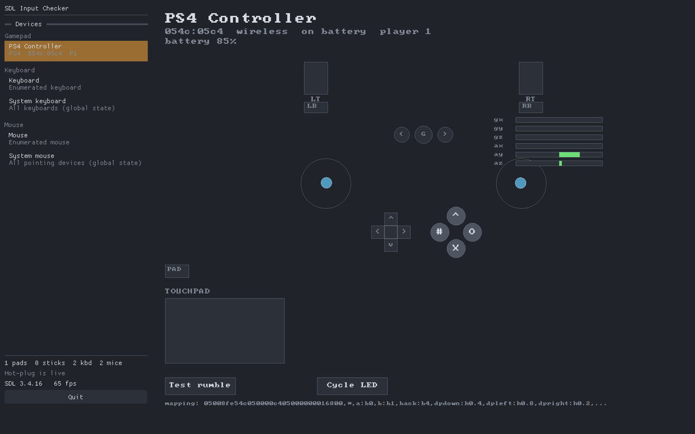
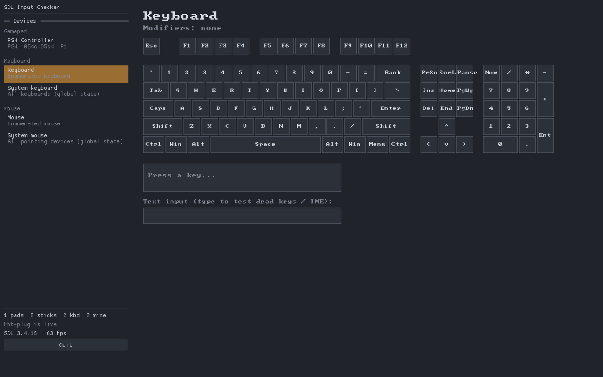
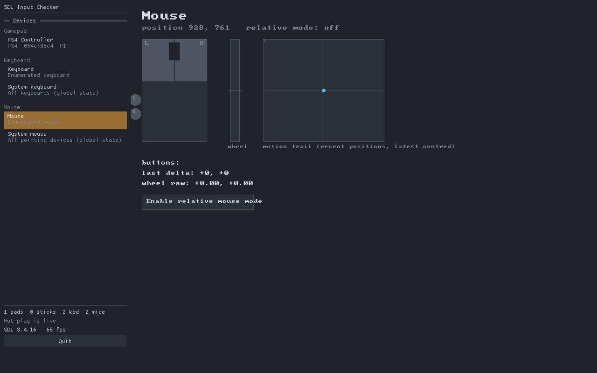
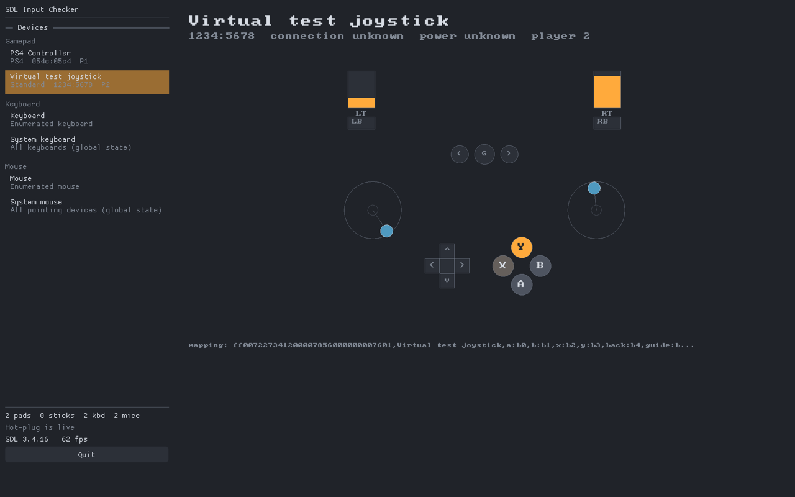

# SDL Input Checker

A small desktop app for macOS and Linux that lists every input device SDL3
can see — gamepads, raw joysticks, keyboards, and mice — and draws a live
picture of what the selected one is reporting.



<table>
<tr>
<td></td>
<td></td>
</tr>
<tr>
<td></td>
<td></td>
</tr>
</table>

## Features

- **Device list** in the sidebar, grouped by kind, updated live on hot-plug.
  A "System keyboard" / "System mouse" entry is always present even when
  SDL's own keyboard/mouse enumeration reports nothing, which is common on
  both macOS and Linux.
- **Gamepad view**: labelled face buttons (Xbox/PlayStation/Switch naming
  via SDL's own button-label API), D-pad, shoulder buttons and trigger
  bars, two analogue stick wells with a deadzone ring, back/guide/start,
  paddle and misc buttons (only shown when the pad actually has them),
  a touchpad panel, gyroscope/accelerometer bars, battery and connection
  info, SDL's own mapping string, and test buttons for rumble and LED
  (also hidden unless the pad supports them).
- **Raw joystick view**: axis bars, a button grid, hat indicators, and ball
  deltas — used for any joystick SDL hasn't mapped to a gamepad.
- **Keyboard view**: a full physical ANSI layout (function row, main block,
  nav cluster, arrow cluster, numpad) with pressed keys lit. Letter and
  punctuation keys read their glyph live from the current OS keyboard
  layout, so a non-US layout shows its own characters on the same physical
  positions. Includes a last-key panel (name/scancode/keycode/repeat) and a
  text-input box for checking dead-key and IME composition.
- **Mouse view**: button state, an XY motion-trail pad, a decaying wheel
  meter, and a toggle for relative (captured) mouse mode.

## Building

Requires CMake 3.24+ and a C++20 compiler.

```bash
cmake --preset debug        # or: release
cmake --build --preset debug
./build/debug/sdl-input-checker
```

SDL3 is looked up with `find_package` first — on macOS, `brew install sdl3`
gives CMake a config to find; on Linux, your distro's `sdl3`/`libsdl3-dev`
package works the same way. If no installed SDL3 is found, CMake fetches
and builds SDL 3.4.16 from source automatically, which is the path most
Linux CI/dev boxes without a packaged SDL3 will take. Dear ImGui is always
fetched, since its SDL3 renderer backend isn't commonly packaged.

### Linux build dependencies

Only needed when SDL3 is being fetched and built from source (i.e. no
system SDL3 package is installed). On Debian/Ubuntu:

```bash
sudo apt install libx11-dev libwayland-dev libxkbcommon-dev libudev-dev \
    libdrm-dev libgbm-dev libasound2-dev libpulse-dev \
    libpipewire-0.3-dev libdbus-1-dev libibus-1.0-dev
```

Raw joystick access on Linux may also need your user in the `input` group,
or a udev rule granting access to `/dev/input/event*` and `/dev/input/js*`.

### macOS app bundle

By default the build produces a plain executable you can run from a
terminal. To build a double-clickable `.app` instead:

```bash
cmake --preset macos-bundle
cmake --build --preset macos-bundle
open build/macos-bundle/sdl-input-checker.app
```

### CMake presets

| Preset | Purpose |
|---|---|
| `debug` | `-Wall -Wextra -Wpedantic`, no optimisation |
| `release` | optimised build |
| `asan` | debug build with AddressSanitizer + UndefinedBehaviorSanitizer |
| `macos-bundle` | release build packaged as a macOS `.app` |

## Usage

Click a device in the sidebar to visualise it. Selecting a gamepad or raw
joystick opens it; switching away closes it again. Press <kbd>Esc</kbd> or
click **Quit** to exit.

## Developer aids

A few environment variables and a flag exist to exercise the app without
plugging in hardware, useful for screenshots and quick manual checks:

| Aid | Effect |
|---|---|
| `--virtual` | Attaches an SDL virtual joystick with animated axes/buttons/hat and selects it at startup. |
| `SIC_SELECT=<kind>` | Auto-selects the first device of the given kind (`gamepad`, `joystick`, `keyboard`, `mouse`) at startup, instead of requiring a sidebar click. |
| `SIC_WINDOW_SIZE=WxH` | Opens the window at a specific size, e.g. `800x500`, for resize testing. |
| `SIC_SCREENSHOT=path.bmp` | Saves one frame as a BMP and quits. |
| `SIC_SCREENSHOT_FRAME=N` | Which frame number to save (default 30). |

Example:

```bash
SIC_SELECT=gamepad SIC_SCREENSHOT=/tmp/frame.bmp ./build/debug/sdl-input-checker --virtual
```

## Project layout

```
src/
├── main.cpp              SDL3 main-callback entry point
├── app/                  Window/renderer/ImGui ownership, sidebar UI
├── devices/               Enumeration, hot-plug, per-frame state sampling
│   ├── DeviceRegistry     Enumerates and opens gamepads/joysticks/kbd/mice
│   ├── *State.h           Per-frame snapshot structs (Gamepad/Joystick/Keyboard/Mouse)
│   ├── KeyboardLayout     Physical ANSI key-position table
│   └── VirtualJoystick    Dev aid: animated SDL virtual joystick
├── views/                 One visualiser per device kind (implements View)
└── draw/                  Canvas: small drawing helper + shared colour palette
```

## Known limitations

- The keyboard held-key state is global (`SDL_GetKeyboardState`), since
  SDL3 does not expose a per-device pressed-key array; selecting a specific
  enumerated keyboard versus "System keyboard" currently shows the same
  held-key state either way.
- Gamepad view panels (touchpad, sensors, rumble/LED tests) are hidden
  automatically when unsupported, but the layout itself is fixed-size and
  not fully responsive below roughly 1000×650 — content lower in the view
  can run past the bottom edge on a very short window rather than
  reflowing.
- IME composition and non-US dead-key sequences are wired up against SDL's
  documented text-input events but need a real layout/IME to fully verify.
